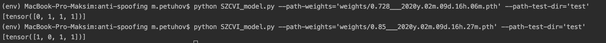

## Project Description

- `dataset.py` - class for comfortable reading data
- `common_functions.py` - common functions for models
- `SZCVI_model.py` - SZCVI model (The video frames were resized into 224×224 images and fed into a CNN model. 
The architecture of this model consists of five convolutional layers and one fully connected layer. 
The convolutional layers were inspired by the VGG model. The scores of the sampled frames were averaged to obtain 
the final score for each video file.)
- `train.py` - code for train models
- `Full.ipynb` - full code for convenience

## Commands for running files
**Train:** 

` python train.py --module-name='SZCVI' --path-train-dir='train_sample' --path-weights='weights/0.728___2020y.02m.09d.16h.06m.pth'`

You can choose not to do define `--path-weights` for training an empty model

**Prediction:** 

`python SZCVI_model.py --path-weights='weights/0.728___2020y.02m.09d.16h.06m.pth' --path-test-dir='test'`

## Example

